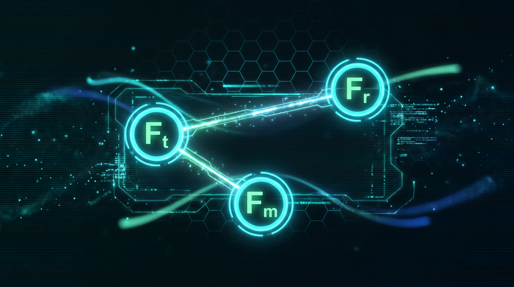
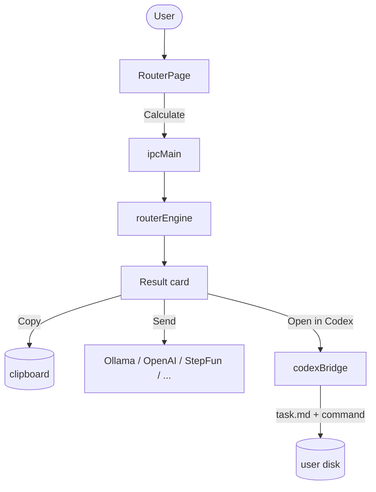

# MASROUTER Desktop

[](LICENSE)
[](https://nodejs.org)
[](https://electronjs.org)
[](https://react.dev)
[](https://typescriptlang.org)
[](tests/)
[](https://arxiv.org/abs/2502.11133)



> **A local desktop app that routes LLM calls in Multi-Agent Systems using the
> MasRouter cascade from [arXiv:2502.11133](https://arxiv.org/abs/2502.11133).**
>
> Multi-agent systems (MAS) are powerful but expensive. Picking the wrong
> topology, the wrong role for the wrong agent, or the wrong model for the
> wrong job silently burns money and time. MASROUTER fixes that with a
> single deterministic cascade — **Fθt → Fθr → Fθm** — that turns any
> natural-language task into a ready-to-run agent chain.

---

## Table of contents

1. [What problem does this solve?](#what-problem-does-this-solve)
2. [How does it work?](#how-does-it-work)
3. [Screenshots](#screenshots)
4. [Quick start](#quick-start)
5. [Connecting model providers](#connecting-model-providers)
6. [Integrating with Codex CLI](#integrating-with-codex-cli)
7. [Security model](#security-model)
8. [Project layout](#project-layout)
9. [Tests](#tests)
10. [Building installers](#building-installers)
11. [Theoretical background](#theoretical-background)
12. [Contributing](#contributing)
13. [License](#license)
14. [Russian documentation](#russian-documentation)

---

## What problem does this solve?

Multi-agent LLM systems are everywhere in 2025. You have agents that analyse,
implement, test, review, deploy. You have topologies — chain, tree, graph,
debate. You have a zoo of models — GPT-4o, Claude, Gemini, DeepSeek, local
Llama through Ollama. **Every existing framework asks you to pick all of this
by hand**, every time, for every task.

That creates four concrete pains:

1. **Money leaks.** A simple "change the button text" task gets routed through
   a 5-agent Chain running on GPT-4o, costing $0.20 when 1 cent would have
   done it.
2. **Quality leaks.** A security-sensitive task gets sent to a cheap model
   with no review pass. A wrong answer in payment code is a real-world
   incident.
3. **Decision fatigue.** Every developer has to make the same routing call
   over and over, with no shared playbook. Different people pick differently
   on the same task.
4. **Audit gap.** When something goes wrong, you cannot point to the
   algorithm that made the routing decision. The decision lives in someone's
   head.

MASROUTER turns all of this into a **single deterministic, inspectable,
testable function**: `calculateRoute(task) → RouteDecision`. The function
embeds the paper's policy-gradient cascade as a rule-based approximation that
is fast, explainable, and free to run.

---

## How does it work?

The whole routing decision is a cascade of three controllers from the
MasRouter paper:

```
Fθ = Fθm ∘ Fθr ∘ Fθt

Fθt : Q → T               (collaboration determiner)
Fθr : (Q, T) → {R_i}      (role allocator)
Fθm : (Q, T, {R_i}) → {M_i}  (LLM router)
```

Read it as: "given a task, first pick the topology, then pick the role
chain, then pick the model for each role."


Internally, the cascade answers four questions in order:

| Step | Question | Output |
|---|---|---|
| 1. Risk Score | Is money / payment / security / database / deploy in play? | `1 / 2 / 3` |
| 2. Cost Mode | Given the risk, should we optimise for cost or quality? | `ECO / BALANCED / QUALITY` |
| 3. Topology (Fθt) | Single agent or a chain? Tree? Debate? | `Single / Chain / Tree / FullConnected / Debate / Reflection` |
| 4. Role chain (Fθr) | Which roles in which order? | `Analyst → Implementer → Tester → Reviewer → SecurityReviewer` |
| 5. Model per role (Fθm) | Which model serves each role? | `gpt-4o-mini / deepseek-chat / ...` |

The user gets a complete `RouteDecision` object with:

- a `Final Prompt` they can copy or send to a model,
- a `Stop Conditions` list,
- a `Server Safety Checklist` for any task that touches a server,
- an `estimated cost` in USD,
- a `Topological Multiplier Γ(k+1)` from the gamma function in the paper,
- and the full reasoning chain `Fθt → Fθr → Fθm` shown as a diagram.

The full request flow inside the Electron app:



---

## Screenshots

The desktop app ships with two themes — a default dark theme (black + cyan +
mint) and a light theme. All screenshots below are from a real run on
Windows 10.

### Router page (the main screen)

The user types a task, picks the type, complexity and risk flags, and the
cascade immediately returns a `RouteDecision` with the chain of roles, the
chain of models, and a `Final Prompt` ready to copy.

The page also shows the `Fθt → Fθr → Fθm` cascade diagram, the `Risk Score`
badge, the `Cost Mode` badge (`ECO / BALANCED / QUALITY`), the value of `λ`,
the `Topological Multiplier Γ(k+1)`, and the `Stop Conditions` list.

### Case Study page

Five preset workflows from Appendix C of the paper — MMLU, GSM8K, MATH,
HumanEval, HumanEval (hard). One click loads the workflow into the
RouterPage.

### Ablation page

A faithful reproduction of Table 3 from the paper. The killer row is
highlighted in red: **without Fθm, performance drops 2.09% on GSM8K and 4.34%
on MATH** — the LLM router is the most important piece of the cascade.

### Model providers page

Six pre-configured models from Appendix E.1, with their per-token price,
benchmark scores, and an "enabled" toggle. A one-click "Test connection"
button uses the actual provider API to verify the key works.

### Codex CLI page

Generates `task.md` in your project folder and copies a ready-to-paste
`codex --prompt-file ...` command. The full router decision is embedded in
the markdown so the downstream agent has full context.

---

## Quick start

### Prerequisites

- Node.js **20+** (tested on 22.11)
- npm **10+** (or pnpm / yarn)
- Windows 10+, macOS 12+, or Linux with a desktop environment

### Run in development

```bash
git clone https://github.com/pavelvladimirovich258614-sys/MASROUTER_Desktop.git
cd MASROUTER_Desktop
npm install
npm run dev
```

`npm run dev` starts the Vite dev server and launches Electron. The window
opens automatically; renderer hot-reloads on save, main requires a restart.

### Run tests and typecheck

```bash
npm test           # 46 Vitest tests, all green
npm run typecheck  # tsc --noEmit for both renderer and main
```

---

## Connecting model providers

The app ships with six pre-configured model slots. For each, you only need to
paste the API key and click **Test connection**.

| Provider | Where to get a key | Default base URL |
|---|---|---|
| Ollama (local) | none — install [ollama.com](https://ollama.com) and run `ollama serve` | `http://127.0.0.1:11434` |
| OpenAI | [platform.openai.com](https://platform.openai.com) | `https://api.openai.com/v1` |
| OpenAI-compatible | your provider's docs | editable in the UI |
| MiniMax | your MiniMax account | editable in the UI |
| StepFun | [platform.stepfun.com](https://platform.stepfun.com) | `https://api.stepfun.com/v1` |
| Custom REST | — | you write the URL, headers, body template, and response path |

API keys are stored in `safeStorage` (OS-level encryption) and shown in the
UI only as a mask.

### Five-line Ollama setup

```bash
# 1. Install Ollama
# 2. Start the server
ollama serve
# 3. Pull a small model
ollama pull llama3.2:3b
# 4. Open MASROUTER → Models → enable "Ollama Local" → click Test
# 5. Enable "Local Llama 3.2 3B" in the Models table
```

You're done. Every task routed to ECO will now hit a local model for free.

---

## Integrating with Codex CLI

Codex CLI is the typical downstream agent that runs the chain MASROUTER
describes. The flow is:

1. Open **Codex CLI** in the sidebar.
2. Pick a profile (CLI path, command template, project path, git branch).
3. Optionally pick a server profile for SSH context.
4. Calculate a route in **RouterPage**.
5. Click **Create task.md** — a markdown file is written to your project
   folder with the full decision, the chain plan, the stop conditions, the
   server safety checklist, and the final prompt.
6. Click **Copy command** — a `codex --prompt-file ... --model ...` command
   with all variables substituted goes to your clipboard.
7. Paste into a terminal in your project folder, run Codex.

The default command template is:

```
codex --prompt-file "{task_file}" --model "{model}" --cd "{project_path}"
```

Available variables: `{task_file}`, `{prompt}`, `{model}`, `{project_path}`,
`{git_branch}`, `{server_host}`, `{ssh_user}`, `{ssh_key}`.

---

## Security model

MASROUTER takes security seriously because it is designed to run on a
developer machine, in production environments, sometimes against production
servers.

- **Process isolation.** Electron is launched with `contextIsolation: true`,
  `nodeIntegration: false`, `sandbox: true`. Renderer code cannot touch
  Node, the filesystem, or `process.env` directly.
- **API keys in `safeStorage`.** The key never leaves the main process and
  is encrypted by the OS keychain (DPAPI on Windows, Keychain on macOS,
  libsecret on Linux). The renderer only ever sees a masked string.
- **Content Security Policy.** The renderer is locked down to `default-src
  'self'` plus a small allowlist of LLM provider domains.
- **External links open in the system browser**, never inside the app.
- **Shell commands disabled by default.** When you enable them in Settings
  → Security, every command goes through a whitelist (`git status`, `git
  log`, `git branch`, `ssh -i <key> ...`) and a stoplist (`rm -rf`, `sudo`,
  `reboot`, `mkfs`, `dd`, `chmod 777`, `curl | sh`, `wget | sh`). Any
  command not on the whitelist requires explicit user confirmation.
- **No telemetry.** No analytics, no crash reporting, no remote calls
  except the LLM provider calls you make.

---

## Project layout

```
MASROUTER_Desktop/
├── electron.cjs               # Electron entry point
├── package.json
├── tsconfig.json              # Renderer + tests
├── tsconfig.main.json         # Main + preload
├── vite.config.ts             # Vite + Vitest config
├── electron-builder.yml       # Installer config
├── assets/                    # Icons + banner
│   ├── icon.svg / icon.png / icon.ico
│   └── banner.png
├── shared/                    # Types and pre-filled data
│   ├── types.ts               # All shared TypeScript types
│   ├── constants.ts           # γ, λ, IPC channels, shell lists
│   ├── schemas.ts             # Zod validation
│   └── masrouterData.ts       # 18 roles, 6 models, 7 topologies, 5 case studies, ablation table
├── src/
│   ├── main/                  # Electron main process
│   │   ├── index.ts           # BrowserWindow + IPC init
│   │   ├── ipc.ts             # All IPC handlers
│   │   ├── storage.ts         # electron-store + safeStorage
│   │   ├── routerEngine.ts    # Fθt → Fθr → Fθm cascade
│   │   ├── promptBuilder.ts   # Final Prompt generator
│   │   ├── costEstimator.ts   # Per-token cost calculation
│   │   ├── gamma.ts           # Lanczos approximation of Γ(z)
│   │   ├── codex/codexBridge.ts
│   │   ├── shell/safeCommandRunner.ts
│   │   └── providers/         # 6 LLM provider adapters
│   ├── preload/
│   │   └── index.ts           # contextBridge — the only renderer → main door
│   └── renderer/              # React + Vite
│       ├── App.tsx
│       ├── main.tsx
│       ├── pages/             # 14 pages
│       ├── components/        # Sidebar, Topbar, CascadeDiagram, Toasts, HelpTip
│       ├── store/             # Zustand store
│       ├── lib/               # API bridge + helpers
│       ├── styles/            # global.css, themes.css, components.css
│       └── help/helpArticles.ts  # 15 in-app help articles
├── tests/                     # 46 Vitest tests
├── docs/                      # Detailed documentation
│   ├── USER_GUIDE_RU.md
│   ├── MODELS_SETUP_RU.md
│   ├── CODEX_INTEGRATION_RU.md
│   ├── MASROUTER_THEORY_RU.md
│   ├── BUILD_RU.md
│   └── diagrams/cascade.md    # Mermaid + ASCII architecture
├── scripts/                   # Build & dev scripts
└── .github/
    ├── workflows/build.yml    # CI: Windows / macOS / Linux
    ├── ISSUE_TEMPLATE/
    └── PULL_REQUEST_TEMPLATE.md
```

---

## Tests

```bash
npm test
```

The repository ships with **46 tests, all green**:

- `tests/gamma.test.ts` — 16 tests for the gamma function (Lanczos
  approximation) and the multinomial coefficient.
- `tests/routerEngine.test.ts` — 14 tests for the Fθ cascade: every cost
  mode, every risk level, the SecurityReviewer rule, the `strong tier`
  fallback, the `agentCount ≤ 6` cap, the visible cascade, the topological
  multiplier.
- `tests/promptBuilder.test.ts` — 6 tests for the Final Prompt template:
  required sections, QUALITY adds SecurityReviewer, serverEdit adds the
  safety checklist.
- `tests/costEstimator.test.ts` — 10 tests for cost calculation: local
  models are zero, cloud models use the right price, missing price
  surfaces a "Not configured" message.

Run a single file: `npx vitest run tests/routerEngine.test.ts`.

---

## Building installers

```bash
npm run build         # Compile renderer (Vite) + main (tsc)
npm run dist:win      # Windows: NSIS installer + portable .exe
npm run dist:mac      # macOS:   DMG + ZIP
npm run dist:linux    # Linux:   AppImage + .deb
```

Outputs land in `release/`:

- `MASROUTER Desktop Setup x.y.z.exe` — Windows NSIS installer (≈ 78 MB)
- `MASROUTER Desktop x.y.z portable.exe` — portable, no install (≈ 78 MB)
- `MASROUTER Desktop-x.y.z.dmg` — macOS
- `MASROUTER Desktop-x.y.z.AppImage` — Linux
- `masrouter-desktop_x.y.z_amd64.deb` — Debian / Ubuntu

Icons are auto-generated from `assets/icon.svg` by
`scripts/generate-icon.mjs` and `scripts/generate-ico.mjs` on every
`npm run dist:*` invocation.

For auto-updates on tagged releases, see
`.github/workflows/build.yml` — it builds on all three platforms and
uploads artefacts to the GitHub release.

---

## Theoretical background

MASROUTER Desktop is a faithful, rule-based implementation of the cascade
described in:

> Yanwei Yue, Guibin Zhang, Boyang Liu, Guancheng Wan, Kun Wang, Dawei Cheng,
> Yiyan Qi. **«MasRouter: Learning to Route LLMs for Multi-Agent Systems».**
> arXiv:2502.11133, 16 February 2025.
> [https://arxiv.org/abs/2502.11133](https://arxiv.org/abs/2502.11133)

The paper formulates multi-agent system routing as a policy-gradient
optimisation over three controllers and proves (Table 3) that removing the
LLM router (Fθm) causes the largest performance drop of any single
controller.

This implementation replaces the learned policies with a hand-written
deterministic approximation. The advantage is explainability and zero
training cost; the disadvantage is that we cannot match the paper's exact
benchmark numbers without retraining the policies on your task distribution.
For a deeper dive into the math, see `docs/MASROUTER_THEORY_RU.md`.

The original code release is at
[https://github.com/yanweiyue/masrouter](https://github.com/yanweiyue/masrouter)
(MIT).

---

## Contributing

Contributions are welcome. Open a GitHub issue to discuss a change before
sending a PR. See [CONTRIBUTING.md](CONTRIBUTING.md) for the workflow and
[.github/PULL_REQUEST_TEMPLATE.md](.github/PULL_REQUEST_TEMPLATE.md) for
the PR checklist.

---

## License

This project is released under the [MIT License](LICENSE). It is based on
the paper *«MasRouter: Learning to Route LLMs for Multi-Agent Systems»*
(arXiv:2502.11133), which is also MIT-licensed by the original authors.

Copyright (c) 2026 Pavel Novopoltsev and MASROUTER contributors.

---

## Russian documentation

A full Russian-language description of the project, its theory, and its
usage lives on the `docs/ru` branch:

```bash
git fetch origin
git checkout docs/ru
cat docs/ru/README.ru.md
```

The Russian branch contains:

- `docs/ru/README.ru.md` — что это, зачем, как работает (на русском)
- `docs/ru/USER_GUIDE_RU.md`
- `docs/ru/MODELS_SETUP_RU.md`
- `docs/ru/CODEX_INTEGRATION_RU.md`
- `docs/ru/MASROUTER_THEORY_RU.md`
- `docs/ru/BUILD_RU.md`

These mirror the in-app Russian help system and are kept in sync with the
English documentation.
