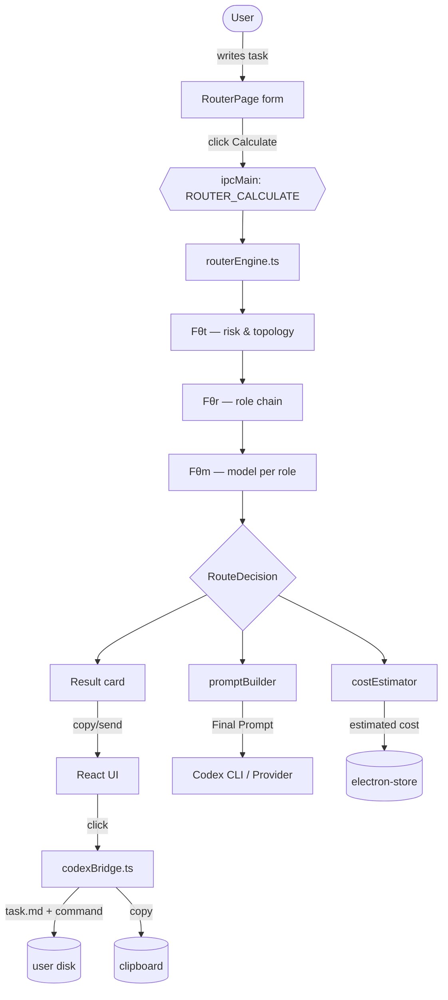
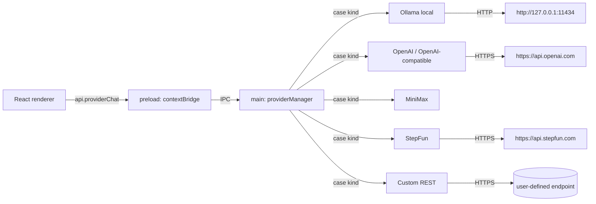
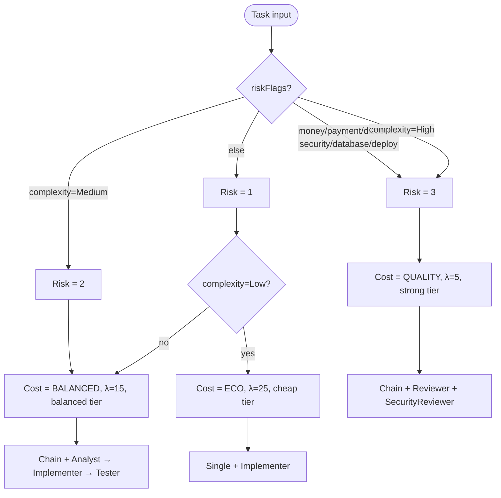

# MASROUTER — Architecture Diagrams

This file documents the internal architecture of MASROUTER Desktop. It is
referenced from the README and can be rendered directly on GitHub or in any
Mermaid-compatible Markdown viewer.

---

## 1. The Fθ cascade (the core idea)

The whole routing decision is a single deterministic cascade:

```
Q (a user task) ──Fθt──▶ T (topology) ──Fθr──▶ {R_i} (chain of roles) ──Fθm──▶ {M_i} (chain of models)
       │                      │                       │                              │
       │                      │                       │                              │
   ┌───┴────┐             ┌────┴────┐              ┌───┴────┐                    ┌────┴────┐
   │ Risk   │             │ Single  │              │ Analyst│                    │ gpt-4o- │
   │ Score  │             │ Chain   │              │ Implem.│                    │  mini   │
   │ 1/2/3  │             │ Tree    │              │ Tester │                    │ Claude  │
   └────────┘             │ FullC.  │              │ Review.│                    │ Gemini  │
                         │ Debate  │              │ SecRev.│                    │ DeepSeek│
                         │ Reflect.│              │ ...    │                    │ Ollama  │
                         └─────────┘              └────────┘                    └─────────┘
```

In code, this lives in `src/main/routerEngine.ts`. The cascade is
**deterministic and rule-based** — no LLM is used inside the router itself,
which keeps it fast, predictable, and auditable.

---

## 2. Request flow inside the Electron app



---

## 3. Provider architecture (LLM I/O)



API keys are stored in `safeStorage` (OS-level encryption) and exposed to the
renderer only as a masked string.

---

## 4. Risk → Cost Mode decision



This mirrors the cascade in the original paper: tasks touching money, security
or databases must always run on strong models with a security review pass.
